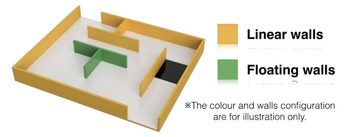
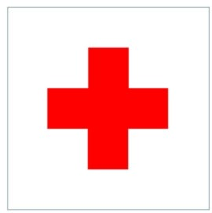

== Field

=== Description

. The field layout will consist of a collection of tiles with a horizontal floor, a perimeter wall, ramps,
and walls within the field.

. All tiles are defined as a 30 cm x 30 cm space.

. All walls used create the maze are at least 15 cm high from any floor, 30 cm in length, and are mounted on the edges of the tiles.

. Tiles will be used as ramps. They will have an incline with a maximum of 25 degrees from the horizontal and are always straight.

=== Floor

. Floors may be either smooth or textured (like linoleum or carpet) and may have deviations of up to 3 mm in height between the tiles. There may be holes in the floor (approximately 5 mm in diameter), for fastening walls.

. Black tiles:
.. Black tiles in the field represent holes, which the robot must avoid.
.. Black tiles will be placed randomly at the start of each game.
.. Black tiles may or may not be completely fixed to the floor.

. Silver tiles:
.. Silver tiles in the field represent checkpoints.
.. Silver tiles will be placed randomly at the start of each game.
.. Silver tiles may or may not be completely fixed to the floor.

=== Path

. Walls lead to the entrance/exit. Walls that lead to the entrance/exit are called "linear walls". The walls that do NOT lead to the entrance/exit are called "floating walls". Floating walls do not exist in the maze.

. Black tiles will affect the determination of wall type (linear or floating), since they can be considered as virtual walls.
+

. Teams must prepare for the pathways to be slightly smaller in dimension (±10% variation on the tile size) than a tile due to the nature of placing walls.

. Pathways for the robot are intended to be of the width of the tile, and may open into foyers wider than the pathways.

. One of the outermost tiles is the starting tile, where a robot should start and exit the run.

. Walls may be removed, added or changed just before a scoring run starts to prevent teams pre-mapping the layout of the fields. Organizers will do their best to not change the length or difficulty of the maze when introducing these changes.

=== Speed Bumps, Debris and Obstacles

. Speed bumps are fixed to the floor and have a maximum height of 1cm.

. Debris is not fixed to the floor and has a maximum height of 3mm.

. Debris may be adjacent to walls.

. Obstacles:

.. have minimum height of 15 cm.
.. may consist of any large, heavy items.
.. may be fixed to the floor.
.. may be any shape including rectangular, pyramidal, spherical or cylindrical.

. An obstacle may be placed in any location where at least 20 cm is left between the obstacle and any wall.

. Obstacles that are moved or knocked over must remain where they are moved or fall and will not be reset during the scoring run.

=== Victims

. Victims are represented by a red cross on a white tile (30 x 30 cm). The cross is centered on the tile and consists of five squares (6 x 6 cm). The color of the cross is traffic red (RAL color
no. 3020).
+

. The tile with the victim is always located next to a wall.

. There will be a minimum number of five (5) victims in a field.

. Victims will never be located on black tiles or on tiles with obstacles.

=== Rescue Kits

. A rescue kit represents a basic health package distributed to a victim caught in a natural disaster. It symbolizes tools, medical supplies or devices used in the rescue process, such as GPS transponders or even something as simple as a light source.

. Because we need to ensure that a rescue kit reaches the victim, it has to stay near the victim after the deployment. For example, it cannot roll away from or bounce off to move away from the victim.

. Each rescue kit must have a minimum volume of 1 cm³.

. A robot can only carry a maximum number of 12 rescue kits.

. Each team is responsible for their own rescue kit system, including bringing the rescue kits to the competition. The team captain is responsible for loading the rescue kits onto their robot and collecting it from the field with the referee’s authorization after the end of the run.

. Deployment of the rescue kit must be very clear to the referee.

=== Environmental Conditions

. The environmental conditions at a tournament may be different from the conditions at home practice fields. Teams must come prepared to adjust their robots to the conditions at the venue.

. Lighting and magnetic conditions may vary in the rescue field.

. The field may be affected by magnetic fields (e.g. generated by under floor wiring and metallic objects). Teams should prepare their robots to handle such interference.

. The field may be affected by unexpected lightning interference (e.g. such as camera flash from spectators). Teams should prepare their robots to handle such interference.

. The Organizing Committee (OC) will try their best to fasten the walls onto the field floor so that the impact from contact should not affect the robot.

. All measurements in the rules have a tolerance of ±10%.

. Objects to be detected by the robot will be distinguishable from the environment by their colour or shape.
