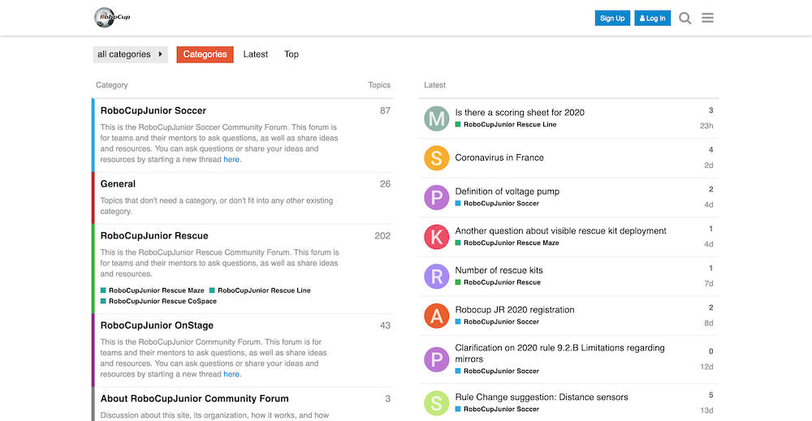

= RoboCupJunior Rescue Maze Entry - Rules 2021
Last update: {docdate}
:toc: macro
:toc-title: Contents
:sectanchors:
:sectlinks:
:xrefstyle: full
:section-refsig: Section
:sectnums:
:sectnumlevels: 3

ifdef::backend-html5[]
++++
<link rel="stylesheet" href="https://use.fontawesome.com/releases/v5.3.1/css/all.css" integrity="sha384-mzrmE5qonljUremFsqc01SB46JvROS7bZs3IO2EmfFsd15uHvIt+Y8vEf7N7fWAU" crossorigin="anonymous">

++++
endif::[]

:icons: font
:numbered:

[cols="2,10,2", options="header"]
|===
3+^|RoboCupJunior Rescue Maze Entry Working Group

|Chair
|Daniel Busse
|Germany

|
|Ansgar Bredenfeld
|Germany

|
|Person 3
|Region 3

|
|Person 4
|Region 4

|
|Person 5
|Region 5

|
|Person 6
|Region 6

|
|Person 7
|Region 7

|===

[cols="2,4,2,5,2", options="header"]
|===
3+^|RoboCupJunior General Chairs 2020
2+^|Trustees representing RoboCupJunior

|Chair
|Person 8
|Region 8
|Person 9
|Region 9

|
|Person 10
|Region 10
|Person 11
|Region 11

|
|Person 12
|Region 12
|Person 13
|Region 13

|
|
|
|Person 14
|Region 14

|===

[discrete]
== Official Resources

[cols="2*^",hrows=1, options="header"]
|===
^|RoboCupJunior Official Site
^|RoboCupJunior Official Forum

a|
[link=https://junior.robocup.org/]
image::media/officialsite.jpg[]
[.text-center]
https://junior.robocup.org/[https://junior.robocup.org/]
a|
[link=https://junior.forum.robocup.org/]

[.text-center]
https://junior.forum.robocup.org/[https://junior.forum.robocup.org/]

|===

WARNING: Corrections and clarifications to the rules may be posted on the Forum in advance of updating this rule file. It is the responsibility of the teams to review the forum to have a complete vision of these rules.

[discrete]
== Before you read the rules

IMPORTANT: Please read through the https://junior.robocup.org/robocupjunior-general-rules/[RoboCupJunior General Rules] before proceeding on with these
rules, as they are the premise for all rules. The English rules published by the
Maze Entry Working Group are the only official rules for  RoboCupJunior Rescue Maze Entry 2021. The translated versions that can be published by each
regional committee are only reference information for non-English speakers to better
understand the rules. It is the responsibility of the teams to have read and understood
the official rules.

[discrete]
== Scenario

The land is simply too dangerous for humans to reach the victims. Your team has been given a difficult
task. The robot must be able to carry out a rescue mission in a fully autonomous mode with no human
assistance. The robot must be durable and intelligent enough to navigate through treacherous terrain
with obstacles and rubble without getting stuck. The robot must search for victims, dispense
rescue kits, and signal the position of the victims so the humans can take over. Time and technical skills
are essential! Come prepared to be the most successful rescue team.

[discrete]
== Summary

The robot needs to search through a maze for victims.  The robot is not supposed to find the fastest path through the maze, instead it should explore as much of the maze as possible.
The robot will be awarded 10 points for each victim found. If the robot can successfully deliver a rescue kit close to the victim, it will earn an additional 10 points.
If the robot is stuck in the maze it can be restarted at the last visited checkpoint. A reflective floor indicates checkpoints so the robot can save the position to a map (if it uses a map) in a non-volatile medium and restore it in case of a restart. The robot must also avoid areas with a black floor.

If the robot can find its way back to the beginning of the maze after exploring the whole maze it will
receive an exit bonus. The robot will also earn a reliability bonus if the robot can exit the maze with a minimum number of restarts.
If the robot can find its way back to the beginning after exploring the maze it will receive 10 bonus points per identified victim as an exit bonus.

The robot can earn additional points by navigating the following obstacles:

* 20 points for going up a ramp
* 10 points for going down a ramp
* 10 points for each visited checkpoint
* 10 points for reaching a checkpoint on the first attempt
* 5 points for passing through each tile with speed bumps

<<<
toc::[]
<<<

include::1.CodeOfConduct.adoc[]

include::2.Field.adoc[]

include::3.Robots.adoc[]

include::4.Play.adoc[]

include::5.OpenTechnicalEvaluation.adoc[]

include::6.ConflictResolution.adoc[]
